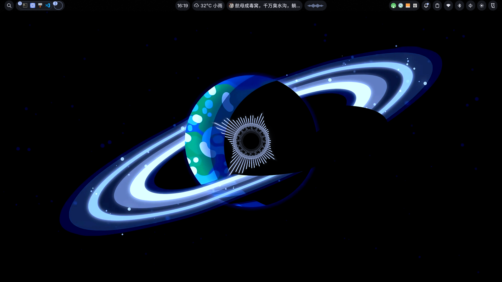
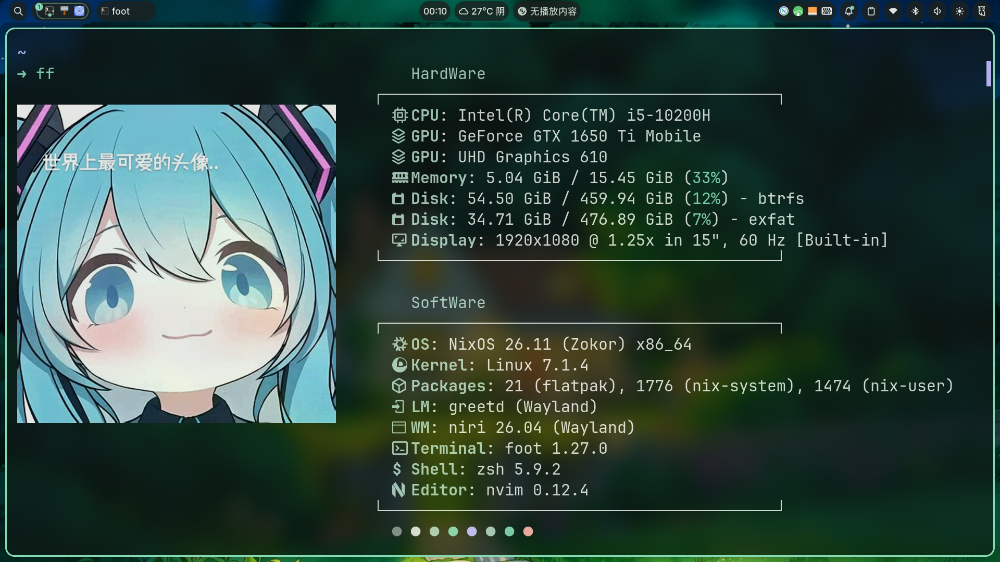

中文 | [English](README_EN.md)

## 概览 (Overview)



> 基于 NixOS + Niri + Noctalia v5 的个人桌面配置。这里记录安装前要确认的内容和日常维护命令。

---

## 背景
我从 Ubuntu 入门，后来用 Arch，最后转到 NixOS。NixOS 的优势是声明式配置、版本锁定和世代回滚：系统可控，也容易恢复。

我现在只使用 NixOS 单系统，只有一台笔记本，没有台式机。

---

## ⚠️ 安装前需要知道的事
安装脚本会分区并格式化目标磁盘。NixOS 不能恢复被格式化的错误磁盘。运行前先用 `lsblk` 确认目标盘。

### 网络与代理配置 (Proxy Settings)
安装 NixOS、拉取 GitHub 仓库和 Nix 缓存可能需要代理。

- **Live ISO 环境**
  此时电脑上还没有代理软件。推荐用手机 USB 网络共享：手机连接电脑，打开"USB 网络共享"，并在 Clash 等代理工具中开启 "Allow LAN / 允许局域网连接"。

  然后在 Live ISO 里查手机共享出来的网关 IP：
  ```bash
  ip route
  ```

  找到类似 `default via 192.168.42.129 ...` 的地址，把它和代理端口写进 `init.sh`：
  ```bash
  export http_proxy="http://192.168.42.129:7890"
  export https_proxy="http://192.168.42.129:7890"
  ```

- **安装后**
  重启进入新系统后，通常就可以使用电脑本机的代理客户端。此时系统代理应指向本机地址，而不是手机网关：
  ```nix
  networking.proxy.default = "http://127.0.0.1:7890";
  ```

  如果你的代理端口不是 `7890`，按实际端口修改。

---

## 🚀 快速开始 (Quick Start)
> `dotfiles/` 通过 Home Manager 链接到 `~/.config/`。改应用配置通常不需要 rebuild，重启或 reload 对应程序即可。
>
> 安装脚本使用两阶段流程：先安装 `#<hostName>-install` 基础系统，再复制仓库并切换到完整 `#<hostName>` 配置。这样可以避免 Home Manager 在首装时引用还不存在的 dotfiles 路径。

### 在 U 盘系统 (Live ISO) 中安装
1. 将配置仓库克隆到本地：
```bash
sudo -i
git clone https://github.com/huzch/nix-dotfiles.git
cd nix-dotfiles
```
2. 执行安装脚本，按提示确认用户名、邮箱、主机名、磁盘、CPU/GPU。脚本会显示 `lsblk`，并要求输入 `ERASE <disk>` 才会格式化：
```bash
./init.sh
```

脚本会询问以下配置，并写回 `hosts/<host>/host.nix`。方括号 `[]` 中是当前值，直接回车会沿用；圆括号 `()` 中是可选值。
```bash
User name [claudia]:
User email [3453289292@qq.com]:
Host name [westwood]:
Target disk [/dev/nvme0n1]:
CPU (amd/intel) [intel]:
GPU (nvidia/amd/intel) [nvidia]:
```

| 优先级 | 配置项 | 需要确认的事 |
| --- | --- | --- |
| P0 | `DISK` | 确认不是 U 盘、移动硬盘或有重要数据的硬盘。 |
| P1 | `GPU` / `USER_NAME` | GPU 影响桌面启动；用户名影响登录和 home 目录。 |
| P2 | `CPU` / `HOST_NAME` | CPU 影响微码；主机名影响 flake 输出名。 |

安装完成后重启。脚本会准备 `~/Documents/nix-dotfiles` 和 `~/Pictures/wallpapers`。

脚本支持断点重试。需要从头开始时使用：
```bash
./init.sh --reset
```

### 💡 快捷键帮助
Niri 默认不在启动时显示快捷键覆盖层（`skip-at-startup`）。日常使用按 **`Super + Shift + /`** 打开快捷键速查表。

---

## 📁 目录结构说明 (Project Structure)
- **`flake.nix`**: 系统入口（自动发现 `hosts/*` 生成全部系统配置）。
- **`hosts/westwood/`**: 机器专属配置（每台机器一个 `hosts/<host>/` 目录）。
  - `host.nix`: 当前机器的用户名、邮箱、磁盘、CPU/GPU 类型与用户清单。
  - `default.nix`: imports 聚合与 `system.stateVersion`。
  - `hardware-configuration.nix`: 安装时生成的硬件配置。
  - `disko.nix`: 分区规则。
- **`modules/nixos/`**: 系统级模块（驱动、网络、字体、服务等，按主题拆分）。
- **`home/claudia/`**: Home Manager 用户级配置（每个用户一个 `home/<user>/` 目录）。
- **`dotfiles/`**: Niri、Noctalia、Neovim 等应用配置。

---

## 🛠️ 如何维护你的配置 (Maintenance)
### 1. 如何安装新软件？
- 系统组件：编辑 `modules/nixos/` 下对应主题文件。
- 日常软件：编辑 `home/claudia/app.nix` 或其他 `home/claudia/` 配置。

包名可在 [search.nixos.org](https://search.nixos.org/packages) 搜索。

### 2. 如何修改桌面外观或快捷键？
- Niri 合成器：编辑 `dotfiles/niri/config.kdl`，然后运行 `niri msg action load-config-file` 热重载。
- Noctalia Shell：通过 Noctalia 设置面板（`Super + F2`）或用 `Super + Z` 打开启动器后搜索设置。

### 3. 如何应用你的修改？
只修改 `dotfiles/` 下已有文件，通常不需要 rebuild。

修改 `.nix`、软件包、服务，或新增 Nix 管理的文件后执行：
```bash
cd ~/Documents/nix-dotfiles

git add .
nh os switch    # 首选系统管理命令（别名 nrs）；底层等价于 sudo nixos-rebuild switch --flake .#westwood
```

升级锁定版本：
```bash
nh os switch -u    # 等价于 nix flake update + nh os switch
```

---

## 🌟 为什么选择 NixOS？(Why NixOS?)
### 1. 绝对的稳定性：版本锁定
`flake.lock` 锁定依赖版本。不运行 `nix flake update`，包版本就不会主动变化。

### 2. 永不崩坏的系统："世代"与回滚
每次 `nixos-rebuild switch` 都会创建新世代。出问题时可从启动菜单回到旧世代。

### 3. "一次配置，到处运行"
系统、用户环境、桌面和应用配置都放在仓库里，方便重装、迁移和审计。

---

## 项目来源与参考

- Fork 自：[huzch/nix-dotfiles](https://github.com/huzch/nix-dotfiles)
- 主要参考：[SHORiN-KiWATA/shorin-arch-setup (noctalia-dotfiles)](https://github.com/SHORiN-KiWATA/shorin-arch-setup/tree/main/noctalia-dotfiles)
- 动画参考代码：https://lagrange-x.lanzouq.com/iQGv93sel3uf

---

## 反馈
Issue 和 PR 欢迎直接提。
